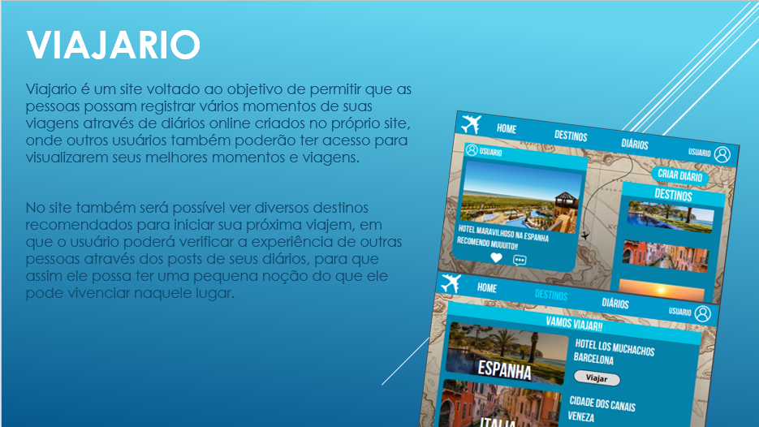
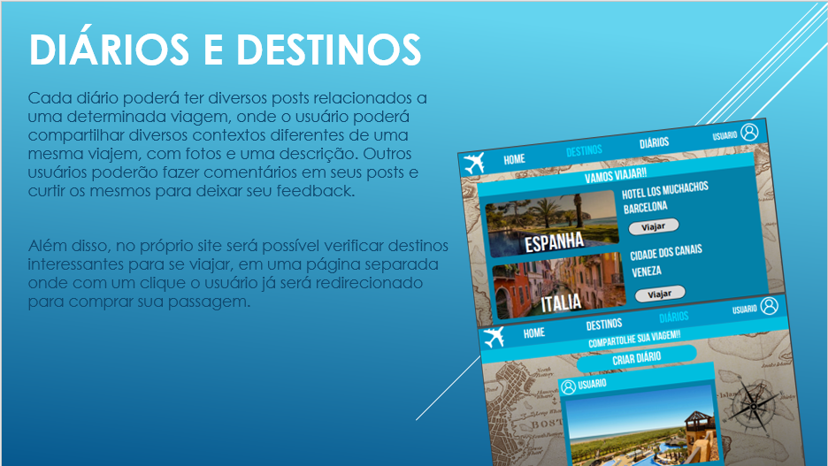
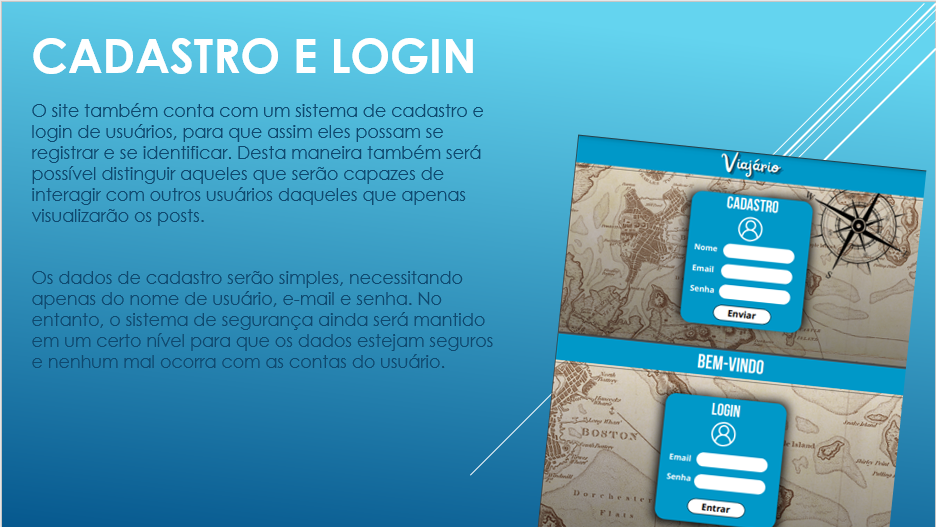
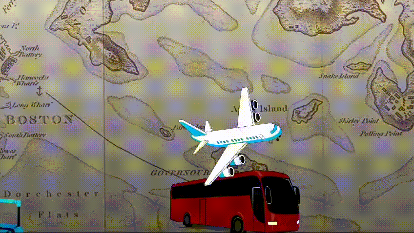

# 🛫 **Viajario**

Este projeto busca unificar diversas experiências de pessoas que se arriscam a se aventurar em diversas viagens, permitindo-as compartilhar suas experiências com outras pessoas que seguem o mesmo instinto aventureiro.

As principais funcionalidades do projeto se baseiam na criação de diários efetuada pelos usuários, onde em seus diários eles poderão publicar fotos com descrições sobre suas viagens, e outros usuários poderão comentar e curtir de forma a deixar seu feedback.

O projeto também contará com um sistema de cadastro e login, para que assim os usuários tenham permissões para usufruirem das funcionalidades fornecidas pelo site. 

Nosso objetivo é proporcionar um espaço onde você possa guardar suas memórias, reviver suas aventuras e inspirar outros viajantes a embarcarem em suas próprias jornadas. Acreditamos que cada viagem é uma história única, repleta de descobertas, desafios e momentos inesquecíveis.

[LINK DO SLIDE DA APRESENTAÇÃO](https://www.canva.com/design/DAGSEhYi30Y/xpJNgei2m2icAJR54l5IOw/edit?utm_content=DAGSEhYi30Y&utm_campaign=designshare&utm_medium=link2&utm_source=sharebutton)
